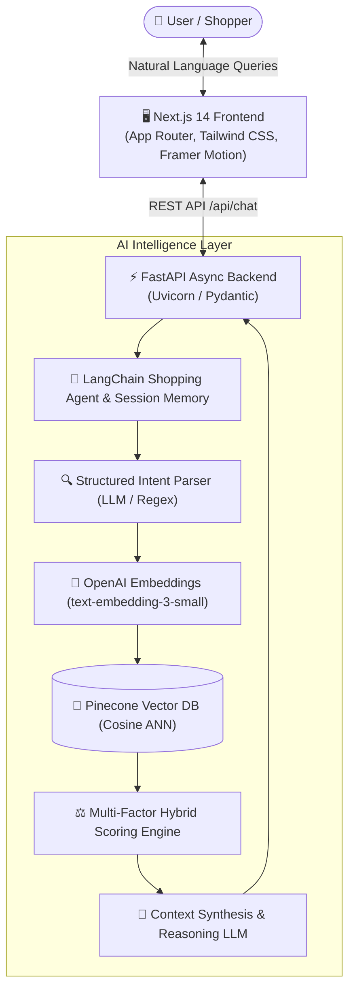

<div align="center">

# 🛒 AI Marketplace Assistant (AIMA)

### *Autonomous Conversational Shopping Agent & Multi-Factor Vector Recommendation Engine*

[](https://nextjs.org/)
[](https://fastapi.tiangolo.com/)
[](https://openai.com/)
[](https://www.pinecone.io/)
[](https://www.langchain.com/)
[](https://tailwindcss.com/)
[](https://www.typescriptlang.org/)
[](https://www.python.org/)

<br/>

[✨ Features](#-key-features) •
[⚖️ Traditional vs AIMA](#-the-problem-vs-the-solution) •
[🏛️ System Architecture](#%EF%B8%8F-system-architecture) •
[🧮 Hybrid Scoring](#-multi-factor-scoring-formula) •
[🚀 Quickstart](#-quickstart-guide) •
[📡 API Reference](#-api-documentation) •
[🌐 Deployment](#-production-deployment)

</div>

---

## 🎯 Overview

**AIMA** redefines e-commerce discovery. Instead of forcing users to fiddle with complex facet filters or guess exact keywords, AIMA acts as an expert autonomous shopping consultant. It understands nuanced natural language, budget ceilings, feature trade-offs, and multi-turn conversations to deliver precise, explainable product recommendations.

> 💡 **Example Prompt:** *"I need a lightweight laptop under ₹1,00,000 for 4K video editing on the go with great battery life, and compare it with MacBooks."*

---

## ⚖️ The Problem vs. The Solution

| Feature | Traditional Keyword Search ❌ | AIMA Autonomous Shopping Agent ✅ |
| :--- | :--- | :--- |
| **Search Paradigm** | Rigid string matching (`keyword`, `price < X`) | Dense Semantic Vector Embedding (`text-embedding-3-small`) |
| **Intent Understanding** | None — fails on phrases like *"great for road running"* | High-precision domain parameter extraction (Category, Budget, Use-cases) |
| **Price Filtering** | Often matches irrelevant cheaper or outlier items | Strict Gaussian & boundary bracket-aware budget filtering |
| **Explainability** | Shows raw product cards with no context | Conversational rationale explaining *why* the product fits the user |
| **Multi-Turn Memory** | Stateless — forgets previous filters | Session memory supporting follow-up questions & direct comparisons |
| **Recommendation Score** | Arbitrary or pure sponsored ranking | 4-Factor Weighted Hybrid Score (Semantic + Budget + Specs + Ratings) |

---

## ✨ Key Features

- 🧠 **Dense Semantic Vector Retrieval**: Powered by Pinecone vector database with fallback to TF-IDF cosine similarity for offline resilience.
- 🎯 **Strict Budget & Price-Bracket Intelligence**: Custom Gaussian proximity and range parsing (e.g. *under 10k*, *around 50k*, *between 30k-40k*).
- 💬 **Multi-Turn Contextual Memory**: Remembers user preferences, previously suggested products, and context for seamless comparative follow-ups.
- ⚡ **Full-Stack Next.js 14 & FastAPI Monorepo**: Modern dark-mode glassmorphic UI built with Tailwind CSS & Framer Motion paired with high-performance async Python backend.
- 🛡️ **Zero-Configuration Fallbacks**: Runs seamlessly out of the box with or without external API keys.

---

## 🏛️ System Architecture



---

## 🧮 Multi-Factor Scoring Formula

Every recommendation is ranked using a balanced, multi-dimensional scoring algorithm:

$$\mathbf{Score} = \mathbf{0.50} \cdot S_{\text{semantic}} + \mathbf{0.20} \cdot S_{\text{budget}} + \mathbf{0.20} \cdot S_{\text{preference}} + \mathbf{0.10} \cdot S_{\text{rating}}$$

```
┌────────────────────────────────────────────────────────────────────────┐
│  • Semantic Similarity (50%): Cosine distance between query & product  │
│  • Budget Fit          (20%): Proximity to target price bracket in INR │
│  • Preference Match    (20%): Exact match on extracted tags & features │
│  • Product Rating      (10%): Verified customer rating weight          │
└────────────────────────────────────────────────────────────────────────┘
```

---

## 📁 Repository Structure

```text
AIMA/
├── 📂 frontend/                    # Next.js 14 App Router Client
│   ├── 📂 app/                     # Routes: /, /chat, /products, /saved
│   ├── 📂 components/              # Chat, Products, Landing, Layout & UI
│   ├── 📂 lib/                     # API Client, State Management & Utils
│   └── 📄 vercel.json              # Vercel Deployment Configuration
│
├── 📂 backend/                     # FastAPI High-Performance Backend
│   ├── 📂 api/                     # REST Endpoints (/api/chat, /api/products)
│   ├── 📂 services/                # LLM, Embeddings, & Recommendation Engine
│   ├── 📂 agents/                  # Shopping Agent & Session Memory Manager
│   ├── 📂 vector/                  # Pinecone Vector Store Client & Local Fallback
│   ├── 📂 models/                  # Pydantic Schemas & Types
│   └── 📄 requirements.txt         # Python Dependencies
│
├── 📂 data/
│   └── 📄 products.json            # 60+ Curated Products across Categories
├── 📂 scripts/
│   └── 📄 ingest_products.py       # Automated Pinecone Vector Ingestion Script
├── 📄 Dockerfile                   # Production Docker Container
├── 📄 .env.example                 # Environment Template
└── 📄 README.md                    # Project Documentation
```

---

## 🚀 Quickstart Guide

### Prerequisites
- **Node.js** (v18.0 or higher)
- **Python** (v3.10 or higher)

### 1. Clone & Setup Environment
```bash
git clone https://github.com/Notyourapple/AIMA.git
cd AIMA

# Copy environment variables template
cp .env.example .env
```

*(Optional: Fill in your `OPENAI_API_KEY` and `PINECONE_API_KEY` in `.env`. If left empty, AIMA will automatically run with built-in high-speed local vector and NLP fallbacks!)*

---

### 2. Start Backend (FastAPI)

```bash
# Navigate to backend directory
cd backend

# Install dependencies
pip install -r requirements.txt

# Start the server
uvicorn main:app --reload --port 8000
```
> 📖 **Interactive Swagger Docs:** Explore and test all endpoints live at [`http://localhost:8000/docs`](http://localhost:8000/docs)

---

### 3. Start Frontend (Next.js)

```bash
# Open a new terminal in the frontend directory
cd frontend

# Install dependencies
npm install

# Start development server
npm run dev
```
> 🌐 **Live Web App:** Visit [`http://localhost:3000`](http://localhost:3000) in your browser.

---

## 📡 API Documentation

<details>
<summary><b>💬 <code>POST /api/chat</code> — Conversational Shopping Agent</b></summary>

#### Request:
```json
{
  "message": "I need a gaming laptop under ₹1,20,000 for AI and gaming",
  "conversation_id": "session-unique-id"
}
```

#### Response:
```json
{
  "conversation_id": "session-unique-id",
  "response": "Here are top-rated laptops fitting your ₹1,20,000 budget with dedicated RTX GPUs for Machine Learning and Gaming:",
  "products": [
    {
      "product": {
        "id": "lap_01",
        "name": "Lenovo Legion Pro 5 Gen 9",
        "brand": "Lenovo",
        "price": 109999,
        "rating": 4.7
      },
      "match_score": 96,
      "reason": "Fits comfortably within ₹1,20,000 budget with ₹10,001 spare. Features RTX 4070 for deep learning."
    }
  ],
  "suggested_followups": [
    "Which of these has the best battery life?",
    "Compare their displays and refresh rates"
  ]
}
```
</details>

<details>
<summary><b>📦 <code>GET /api/products</code> — Product Catalog with Filters</b></summary>

**Parameters:**
- `category` *(string, optional)*: e.g. `laptop`, `smartphone`, `audio`, `shoes`
- `min_price` / `max_price` *(float, optional)*: Budget bounds
- `brand` *(string, optional)*: Filter by brand name

**Example:**
`GET /api/products?category=smartphone&max_price=20000`
</details>

<details>
<summary><b>🔍 <code>GET /api/products/{id}/similar</code> — Vector Similarity Recommendations</b></summary>

Retrieves top-$k$ products matching the semantic embedding of a specific product ID.

**Example:**
`GET /api/products/lap_01/similar?limit=4`
</details>

---

## 🌐 Production Deployment

### 🐳 Backend on Render / Railway (Docker)
1. Link your GitHub repository to [Render](https://render.com).
2. Choose **Web Service** → Select **Docker** environment.
3. Add your environment variables (`OPENAI_API_KEY`, `PINECONE_API_KEY`, etc.) in the Render dashboard.
4. Deploy!

### ⚡ Frontend on Vercel
1. Import repository on [Vercel](https://vercel.com).
2. Set **Root Directory** to `frontend`.
3. Add Environment Variable:
   - `NEXT_PUBLIC_API_URL` = `https://your-backend-url.onrender.com`
4. Click **Deploy**.

---

## 🛡️ License

Distributed under the **MIT License**. Created with ❤️ for advanced AI portfolio demonstration.
